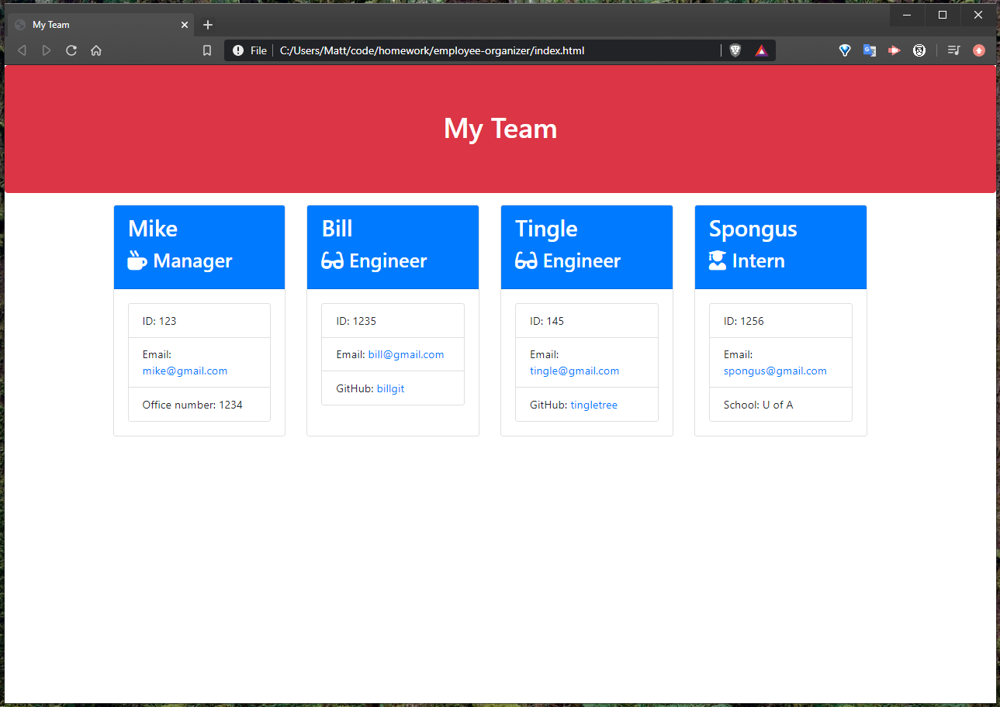
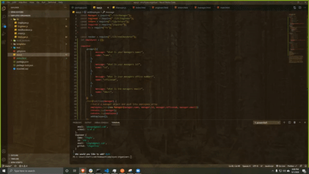

# Employee-Organizer
## A CLI-based application used to organize employees into cards on an HTML file. 

# Table of Contents :
      
- [Installation](#installation)
- [Contributing](#contribution)
- [Test](#tests)
- [Questions](#questions)
## Installation:
N/A 
## Usage:
An introductory project to learn the basics of node.js. 
## Contributing:
N/A   
## Questions
If you have any questions, please feel free to email me at m.bonnev10@gmail.com or take a look at my github page: https://github.com/mbone1 

